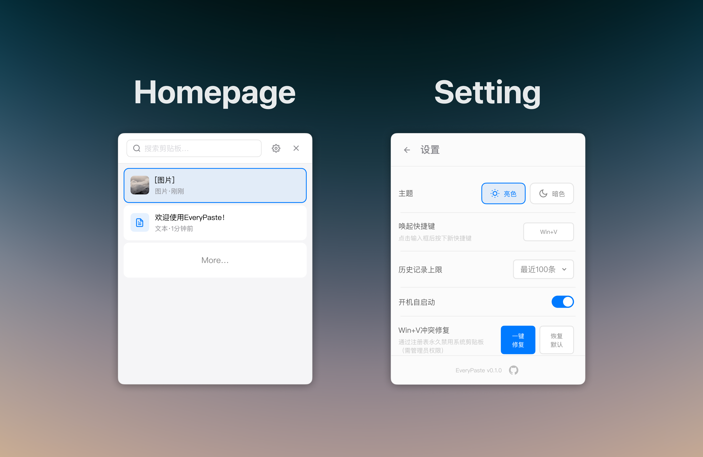

<div align="center">
  
  
  > 为避免不必要的误解，声明：本项目使用 AI Coding。
  
  <p align="center">
    <br /><br />
    <a href="https://github.com/ZhanYiHui06/EveryPaste/releases">
      
    </a>
    <a href="https://github.com/ZhanYiHui06/EveryPaste/releases">
      
    </a>
    <a href="LICENSE">
      
    </a>
    <a href="https://github.com/ZhanYiHui06/EveryPaste/stargazers">
      
    </a>
    <br />
    
    
    
    
    
    <br /><br />
    <a href="https://github.com/ZhanYiHui06/EveryPaste/releases"><strong>📦 下载安装</strong></a>&nbsp;&nbsp;|&nbsp;&nbsp;
    <a href="#-特性"><strong>✨ 特性</strong></a>&nbsp;&nbsp;|&nbsp;&nbsp;
    <a href="#%EF%B8%8F-安装"><strong>⚙️ 安装</strong></a>
    <br />
    <br />
  </p>
</div>

---

## 🖼️ 预览

<p align="center">
  
</p>

---

## ✨ 特性

- ✅ 基于 **Tauri 2.0** + **Rust** 构建，资源占用极低
- ⚡ **极速响应** - 原生性能，内存占用小
- 🖼️ **图片支持** - 自动捕获并保存剪贴板中的图片
- 📝 **富文本支持** - 粘贴时保留格式
- 🔍 **全文搜索** - 快速查找任意剪贴板内容
- ⌨️ **自定义快捷键** - 自定义唤起热键（默认：`Alt+V`）
- 🎨 **明暗主题** - 支持亮色/暗色主题切换
- 🔒 **隐私优先** - 所有数据本地存储于 SQLite 数据库
- 🪟 **Win+V 集成** - 可选注册表修复，替代 Windows 剪贴板
- 🚀 **开机自启** - 支持开机自动启动
- 💾 **可配置历史** - 可设置保存 100、200、500 条或不限制

---

## 📦️ 安装

### 下载安装包

访问 [Releases](https://github.com/ZhanYiHui06/EveryPaste/releases) 页面下载最新安装包：

- **Windows (NSIS)**: `EveryPaste_x.x.x_x64-setup.exe`
- **Windows (MSI)**: `EveryPaste_x.x.x_x64_en-US.msi`

### 从源码构建

参见下方 [构建](#️-构建) 章节。

---

## ⌨️ 快捷键

| 快捷键 | 功能 |
|--------|------|
| `Alt+V`（默认） | 打开/关闭 EveryPaste |
| `↑` / `↓` | 上下选择剪贴板项目 |
| `Enter` | 粘贴选中项 |
| `Shift+Enter` | 粘贴为纯文本 |
| `Escape` | 关闭窗口 |

> 💡 **提示**：可在设置中自定义唤起快捷键。

---

## 🔧 Win+V 冲突修复

~~如果想使用 `Win+V` 作为唤起快捷键，EveryPaste 提供一键注册表修复功能来禁用 Windows 内置剪贴板历史：~~

1. ~~打开 **设置** → **Win+V 冲突修复**~~
2. ~~点击 **"一键修复"**（需要管理员权限）~~
3. ~~在唤起快捷键设置中将快捷键改为 `Win+V`~~

~~如需恢复 Windows 剪贴板，点击同一设置区域的 **"恢复默认"** 即可。~~

> ⚠️ **注意**：该功能目前仍存在问题，无法使用。禁用 Windows 默认剪贴板快捷键请参考：https://blog.hwangzhun.com/archives/1745832071600

---

## 🛠️ 构建

### 环境要求

- [Node.js](https://nodejs.org/) (v18 或更高版本)
- [Rust](https://www.rust-lang.org/tools/install) (最新稳定版)
- [Tauri CLI](https://tauri.app/v1/guides/getting-started/prerequisites)

### 构建步骤

```bash
# 克隆仓库
git clone https://github.com/ZhanYiHui06/EveryPaste.git
cd EveryPaste

# 安装依赖
npm install

# 开发模式
npm run dev

# 生产构建
npm run build
```

构建好的安装包位于 `src-tauri/target/release/bundle/` 目录下。

---

## 📁 项目结构

```
EveryPaste/
├── src/                    # 前端 (HTML/CSS/JS)
│   ├── index.html
│   ├── scripts/
│   │   └── main.js
│   └── styles/
│       ├── main.css
│       └── themes/
├── src-tauri/              # 后端 (Rust)
│   ├── src/
│   │   ├── lib.rs          # 主入口
│   │   ├── clipboard/      # 剪贴板监控
│   │   ├── commands/       # Tauri 命令处理
│   │   ├── config/         # 设置管理
│   │   ├── storage/        # SQLite 数据库
│   │   └── tray/           # 系统托盘
│   └── Cargo.toml
└── package.json
```

---

## 🔐 隐私说明

EveryPaste 所有剪贴板数据均存储在本地：

- **数据库位置**：`%APPDATA%/com.everypaste.app/data.db`
- **无云端同步** - 数据永不离开你的设备
- **无数据分析** - 不追踪、不收集任何信息

---

## 📝 技术栈

- **前端**：HTML5、CSS3、原生 JavaScript
- **后端**：Rust
- **框架**：[Tauri 2.0](https://tauri.app/)
- **数据库**：SQLite（通过 [rusqlite](https://github.com/rusqlite/rusqlite)）
- **剪贴板**：[arboard](https://github.com/1Password/arboard)
- **图片处理**：[image](https://github.com/image-rs/image)
- **哈希算法**：[blake3](https://github.com/BLAKE3-team/BLAKE3)

---

## 📜 开源许可

本项目基于 [MIT 许可证](LICENSE) 开源。

---

## 🙏 致谢

- [Tauri](https://tauri.app/) - 构建更小、更快、更安全的桌面应用
- [arboard](https://github.com/1Password/arboard) - 跨平台剪贴板库
- [rusqlite](https://github.com/rusqlite/rusqlite) - SQLite 的 Rust 绑定

---

## ⭐ Star 历史

<a href="https://star-history.com/#ZhanYiHui06/EveryPaste&Date">
 <picture>
   <source media="(prefers-color-scheme: dark)" srcset="https://api.star-history.com/svg?repos=ZhanYiHui06/EveryPaste&type=Date&theme=dark" />
   <source media="(prefers-color-scheme: light)" srcset="https://api.star-history.com/svg?repos=ZhanYiHui06/EveryPaste&type=Date" />
   
 </picture>
</a>

---

<div align="center">
  <sub>Vibe Coding by <a href="https://github.com/ZhanYiHui06">ZhanYiHui06</a></sub>
</div>
